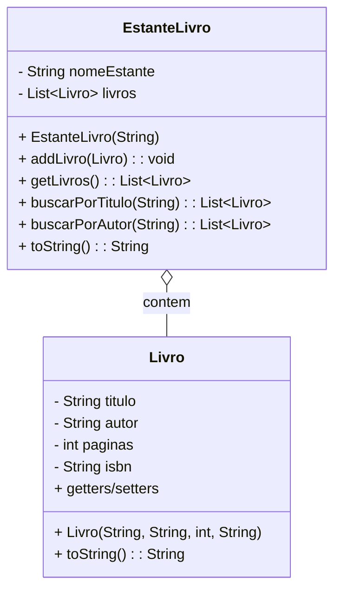

# Engenharia de Software - BERTOTI

## Atividade 1 – Comentar os trechos do livro "Software Engineering at Google"
 
O primeiro trecho destaca como, ao longo dos anos, sempre se teve diferença na visão das pessoas entre dizer que você é um **“Programador”** — visto como um trabalho, algo mais intangível — e um **“Engenheiro de Software”** — respeitado como outros engenheiros —, embora na prática os dois sejam parecidos e interlaçados.

## Atividade 2 – Comentar os trechos do segundo artigo

O segundo trecho destaca como os engenheiros de software pensam na **“programação ao longo do tempo”**. O engenheiro leva em conta a **escalabilidade** do projeto, o **ciclo de vida** da aplicação, os **trade-offs** e até o **custo**.

## Atividade 3 – Listar e explicar 3 exemplos de trade-offs

1. **Desempenho × Segurança**  
   Implementar segurança de alto nível costuma comprometer o desempenho da aplicação, então é necessário avaliar quantos níveis de segurança a aplicação realmente precisa.

2. **Escalabilidade × Complexidade**  
   Decidir se a aplicação rodará em um ambiente de nuvem controlado, com funcionalidades limitadas, ou em um ambiente próprio, com maior controle sobre as variáveis, mas alcance potencialmente mais restrito.

3. **Requisitos × Viabilidade Técnica**  
   Queremos uma aplicação que rode **“em qualquer dispositivo”** (solução mais simples, porém restrita em recursos) ou uma aplicação mais robusta, com variados recursos, mas que seja mais pesada e rode em menos plataformas?

---

## Atividade 4 – Diagrama UML da classe **Livro**

```text
+---------------------------+
|           Livro           |
+---------------------------+
| - titulo: String          |
| - autor: String           |
| - paginas: int            |
| - isbn: String            |
+---------------------------+
| + Livro(titulo:String,    |
|         autor:String,     |
|         paginas:int,      |
|         isbn:String)      |
| + get/set (cada campo)    |
| + toString(): String      |
+---------------------------+
```

---

## Atividade 5 – Classes Java

### Classe **Livro**

```java
public class Livro {
    private String titulo;
    private String autor;
    private int paginas;
    private String isbn;

    public Livro(String titulo, String autor, int paginas, String isbn) {
        this.titulo = titulo;
        this.autor = autor;
        this.paginas = paginas;
        this.isbn = isbn;
    }

    // Getters e setters omitidos para brevidade

    @Override
    public String toString() {
        return "Livro{" +
                "titulo='" + titulo + ''' +
                ", autor='" + autor + ''' +
                ", paginas=" + paginas +
                ", isbn='" + isbn + ''' +
                '}';
    }
}
```

### Classe **EstanteLivro**

```java
import java.util.List;
import java.util.LinkedList;

public class EstanteLivro {
    private String nomeEstante;
    private List<Livro> livros = new LinkedList<>();

    public EstanteLivro(String nomeEstante) {
        this.nomeEstante = nomeEstante;
    }

    public void addLivro(Livro livro) {
        livros.add(livro);
    }

    public List<Livro> buscarPorTitulo(String titulo) {
        List<Livro> encontrados = new LinkedList<>();
        for (Livro livro : livros) {
            if (livro.getTitulo().equalsIgnoreCase(titulo)) {
                encontrados.add(livro);
            }
        }
        return encontrados;
    }

    public List<Livro> buscarPorAutor(String autor) {
        List<Livro> encontrados = new LinkedList<>();
        for (Livro livro : livros) {
            if (livro.getAutor().equalsIgnoreCase(autor)) {
                encontrados.add(livro);
            }
        }
        return encontrados;
    }

    @Override
    public String toString() {
        return "EstanteLivro{" +
                "nomeEstante='" + nomeEstante + '\'' +
                ", livros=" + livros +
                '}';
    }
}
```

---

## Atividade 6 – Diagrama UML da classe **EstanteLivro**

```text
+-------------------------------+
|         EstanteLivro          |
+-------------------------------+
| - nomeEstante: String         |
| - livros: List<Livro>         |
+-------------------------------+
| + EstanteLivro(nome:String)   |
| + addLivro(Livro): void       |
| + getLivros(): List<Livro>    |
| + buscarPorTitulo(String):    |
|       List<Livro>             |
| + buscarPorAutor(String):     |
|       List<Livro>             |
| + toString(): String          |
+-------------------------------+
```

---

## Atividade 7 – Classe de Teste

```java
public class TestarEstanteLivro {
    public static void main(String[] args) {
        // Criando alguns livros
        Livro l1 = new Livro("Dom Casmurro", "Machado de Assis", 288, "978-85-359-0277-8");
        Livro l2 = new Livro("O Hobbit", "J. R. R. Tolkien", 320, "978-85-98078-15-2");
        Livro l3 = new Livro("Quincas Borba", "Machado de Assis", 240, "978-85-359-0278-5");

        // Criando uma estante e adicionando os livros
        EstanteLivro estante = new EstanteLivro("Clássicos");
        estante.addLivro(l1);
        estante.addLivro(l2);
        estante.addLivro(l3);

        // Exibindo as informações da estante e dos livros
        System.out.println(estante);

        // Buscando por título
        System.out.println("Busca por título 'O Hobbit': " + estante.buscarPorTitulo("O Hobbit"));

        // Buscando por autor
        System.out.println("Busca por autor 'Machado de Assis': " + estante.buscarPorAutor("Machado de Assis"));
    }
}
```

---

## Atividade 8 – Diagrama completo Biblioteca


